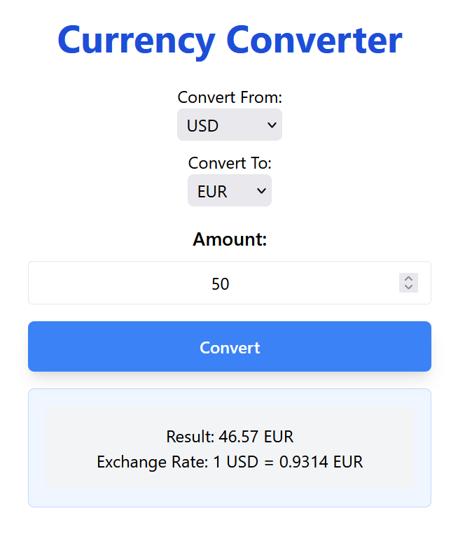

# Java Currency Converter

This is a Java-based Currency Converter application that uses the ExchangeRate-API to provide real-time currency conversion rates. It includes a graphical user interfac built with `JFrame` that allows users to convert between popular currencies.

## Features
- Converts between multiple currencies including USD, GBP, EUR, and more.
- Real-time exchange rates using [ExchangeRate-API](https://www.exchangerate-api.com/).
- Simple and intuitive GUI for easy use.
- Displays results in a user-friendly format.

## Installation

### Prerequisites
- Java Development Kit (JDK) 8 or higher.
- Apache Maven 3.0 or higher.
- An internet connection for fetching exchange rates.
- A (free) ExhangeRate API key in api_key.txt in the root directory.

## Compilation and Running

### Compilation
To compile the project using Maven, run the following command from the project root directory:

```sh
mvn clean install
```

### Running
To run the project using Maven, use the following command:

```sh
mvn exec:java
```

### Running Tests
To run the tests, use the following command:

```sh
mvn test
```

# Credits
- Icon: [Business and finance icons created by cah nggunung - Flaticon](https://www.flaticon.com/free-icons/business-and-finance).

# License
This project is licensed under the MIT License. See the LICENSE file for more details.


